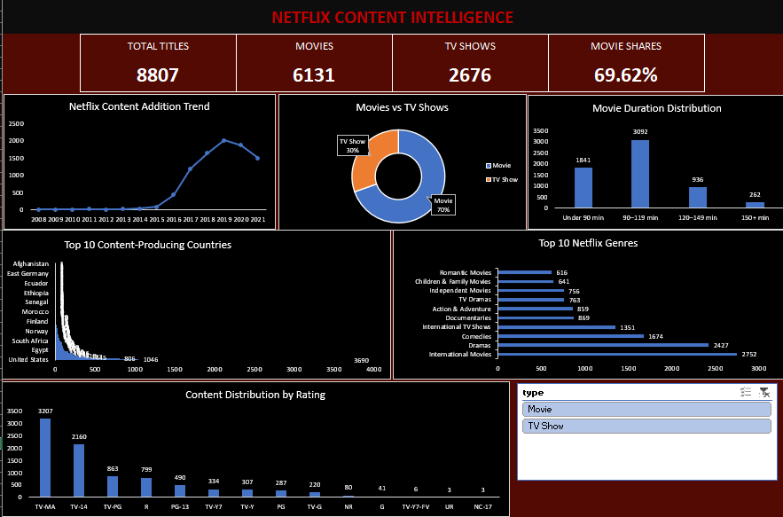

# 📊 Netflix Content Intelligence Dashboard

An interactive **Netflix Content Intelligence Dashboard built in Microsoft Excel** to analyze Netflix's content catalog and uncover insights across content type, release trends, countries, genres, ratings, and movie duration.

---

## 📸 Dashboard Preview



---

## 🎯 Project Objective

The objective of this project is to transform raw Netflix catalog data into an interactive and visually appealing **Excel dashboard**.

The dashboard helps analyze:

- Total Netflix titles
- Movies vs TV Shows
- Netflix content addition trends
- Top content-producing countries
- Most common Netflix genres
- Content distribution by rating
- Movie duration distribution
- Movie and TV Show filtering

---

## 📌 Key Performance Indicators

| KPI | Value |
|---|---:|
| 🎬 Total Titles | **8,807** |
| 🎥 Movies | **6,131** |
| 📺 TV Shows | **2,676** |
| 📊 Movie Share | **69.62%** |

---

## 📈 Dashboard Features

### 1. Netflix Content Addition Trend

A line chart showing how Netflix content additions changed over the years.

This helps identify periods of rapid growth in Netflix's content catalog.

---

### 2. Movies vs TV Shows

A doughnut chart comparing the distribution of:

- Movies
- TV Shows

Movies account for the larger portion of the dataset.

---

### 3. Movie Duration Distribution

Movies are categorized into different duration groups:

- Under 90 minutes
- 90–119 minutes
- 120–149 minutes
- 150+ minutes

This provides an overview of the typical movie duration available in the dataset.

---

### 4. 🌍 Top 10 Content-Producing Countries

A horizontal bar chart showing the countries with the highest number of Netflix titles.

This provides insight into the geographical distribution of Netflix content.

---

### 5. 🎭 Top 10 Netflix Genres

The dashboard identifies the most frequently represented genres/categories in the dataset.

Examples include:

- International Movies
- Dramas
- Comedies
- International TV Shows
- Documentaries
- Action & Adventure

---

### 6. 🔞 Content Distribution by Rating

The dashboard analyzes Netflix titles according to their content ratings.

Examples include:

- TV-MA
- TV-14
- TV-PG
- R
- PG-13
- TV-Y7
- TV-Y
- PG
- G
- TV-G
- NR

---

### 7. 🔎 Interactive Content Type Filter

An interactive filter allows users to analyze the dashboard based on content type:

```text
Movie
TV Show

Netflix-Content-Intelligence/
│
├── README.md
│
├── netflix_titles.xlsx
│
└── image/
    └── DASHBOARD.png
